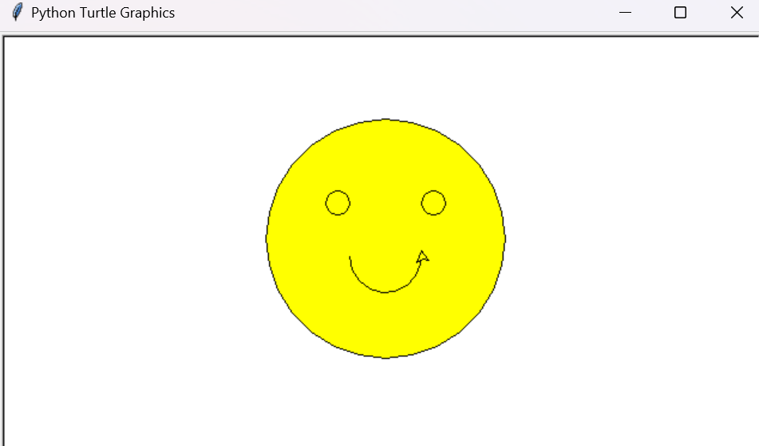

# Smiley Python Turtle Drawing

This Python script, `smiley.py`, utilizes the `turtle` module to draw a simple smiley face. The face consists of a large yellow circle, two smaller circles for eyes, and a curved line depicting a smile.

## How to Use

1. **Requirements:**
   - Python installed on your system.
   - Ensure the `turtle` module is available.

2. **Running the Script:**
   - Clone this repository or download the `smiley.py` file.
   - Open a terminal or command prompt.
   - Navigate to the directory containing `smiley.py`.
   - Run the script using Python: `python smiley.py`.
   - A window will open displaying the drawn smiley face.

## Script Overview

- `smiley.py` contains Python code using the `turtle` module to draw various shapes to create a smiling face.
- It uses basic turtle graphics commands to draw:
  - A large yellow circle as the face.
  - Two smaller circles as eyes.
  - An arc to represent a smiling mouth.

## Screenshot

## Modification and Learning

Feel free to modify the script and experiment with different shapes, colors, or sizes to create your variations of smiley faces. This script is an excellent starting point for learning about Python's turtle graphics and basic programming concepts like shapes, colors, and coordinates.
